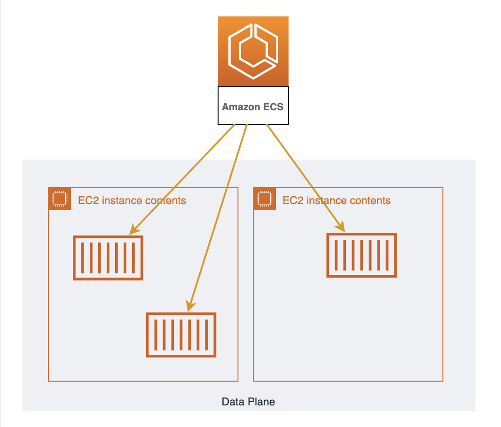
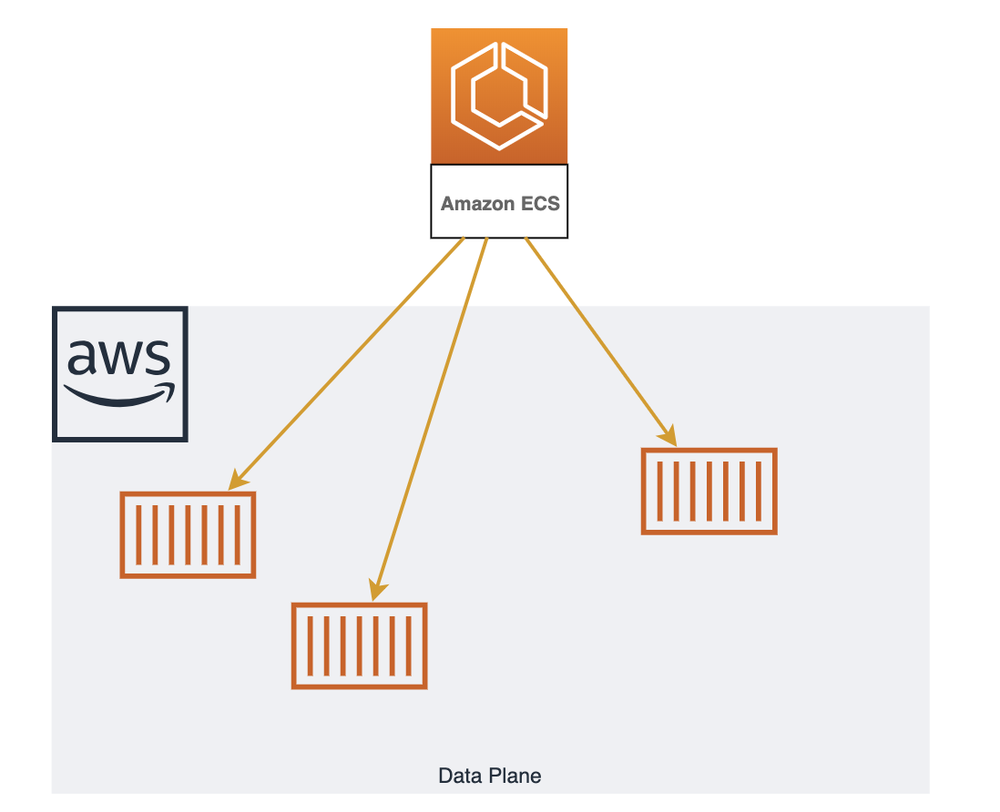

**"Elastic Container Service"** はAWSが開発したDockerオーケストレーションツールです。  
開発者はコンテナを動かすことに集中できるよう開発されていてクラスターの管理はAWSが行ってくれます。  
そのため、プロダクションで活用するまでの学習コストが低く、他のAWSサービスとの連携もしやすいことが特徴です。

## 構成

ECSは **"コントロールプレーン"** と **"データプレーン"** の2つに別れます。  

データプレーンは1台以上のEC2をリソースプールとして扱うもので、データプレーン上にコンテナは配置されます。  
コントロールプレーンはデータプレーン上へコンテナの配置とその管理を行います。  

基本的に開発者はEC2を立てて、ECSのコンソール上で「どんなコンテナが必要か」定義するだけであとはよしなにコンテナが動きます。  

!!! note "Fargate"
    データプレーンを構成するEC2郡は開発者が管理する必要があります。  
    OS/ライブラリのアップデート/セキュリティパッチや使わなくなったファイルのローテート、リソースが足りなくなった際にスケールさせるなどを行う必要があります。  
    Fargateは **"データプレーンの第二の選択肢"**です。  
    コンテナを動かすリソースプールとして、開発者が管理するEC2郡ではなくAWSがマネージするリソースプールを使用します。  
    これによりEC2の管理から手離れができ学習コスト/運用コストが低くなります。反面、EC2をうまく使った時より利用料は高くなります。  
    基本的にAWSに不慣れな場合はデータプレーンにEC2ではなくFargateを選択したほうが良いでしょう。  
    

## Black Belt
- [20180220 AWS Black Belt Online Seminar - Amazon Container Services](https://www.slideshare.net/AmazonWebServicesJapan/20180214-aws-black-belt-online-seminar-amazon-container-services/AmazonWebServicesJapan/20180214-aws-black-belt-online-seminar-amazon-container-services)
    - AWS公式のECS入門資料
