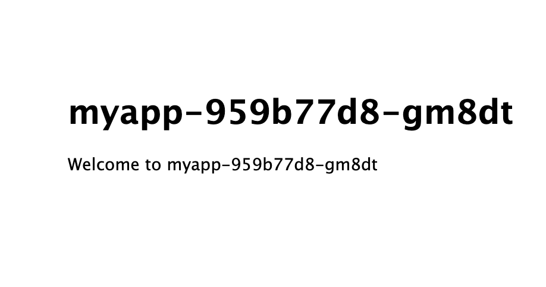

この章ではDockerイメージの作成を行い、GCPのDockerレジストリのGCRへpushし、そのイメージをGKE上で立ち上げてみます。  
GKEをプロダクションで使う場合はDockerイメージの格納にGCRを使うのが一般的でしょう。

## Expressプロジェクトを作成
まずはExpressフレームワークをローカルで作成します。  
Cloud Shell にはnodeが入っているのでそれを使ってもよいのですが、Dockerの使い方の1つである「ホストの環境を汚さずにコマンドを実行できる」ことを体験するためにDockerでnodeの環境を用意します。

Nodeのシェル起動します。  
ここで重要なのは現在のディレクトリをコンテナの `/data` へマウントしていることです。
```console
$ docker run -it -p 3000:3000 -v `pwd`:/data node:10-alpine ash
```

コンテナ内に入った後、Node.jsが存在することを確認します。
```console
# node -v
v10.15.3
```

Expressプロジェクトの作成を行います。
```console
# cd /data
# npm install -g express-generator
# express myapp
# cd myapp
# npm install
```

ここでシェルを抜けずに `# npm start` でExpressを起動すると、3000ポートでExpressの起動を確認することができます。

## ローカルにExpressのコードが展開されていることを確認
Nodeコンテナからexitし、ホストにExpressのコードが存在することを確認します。
```console
# exit
$ ls
myapp
$ ls myapp/
bin             node_modules       package.json      routes
app.js          package-lock.json  public            views
```

## Expressのコードを編集
ホストネームを表示させるようにして、複数台コンテナを立てたときに別のコンテナにアクセスできていることを確認できるようにします。

```console
$ vi routes/index.js
```

```diff
var express = require('express');
var router = express.Router();
+var os = require('os');

/* GET home page. */
router.get('/', function(req, res, next) {
-  res.render('index', { title: 'Express' });
+  res.render('index', { title: os.hostname() });
});

module.exports = router;
```

## Dockerfileの作成
```console
$ vi Dockerfile
```
```dockerfile
FROM node:10-alpine

WORKDIR /app

COPY package.json package-lock.json /app/

RUN npm install

COPY . .

CMD ["npm", "start"]
```

```console
$ docker build -t myapp .
$ docker run -p 3000:3000 myapp
```

[http://localhost:3000](http://localhost:3000) へアクセスして確認

## GCRへpush
Google Container Registry へ作成したイメージを登録します。

pushをするためにGCRの命名規則に則ったtagをイメージへ付与します
```console
$ prjid=$(gcloud config get-value project)
$ docker tag myapp asia.gcr.io/${prjid}/myapp
```

GCRの認証を行い、作成したイメージをpushします。
```console
$ gcloud auth configure-docker
$ docker push asia.gcr.io/${prjid}/myapp
```

## デプロイ
GCRへ上げたイメージを使ってExpressをデプロイを実行
```console
$ kubectl run myapp --image=asia.gcr.io/${prjid}/myapp
$ kubectl get all -l run=myapp
NAME                       READY   STATUS    RESTARTS   AGE
pod/myapp-959b77d8-gm8dt   1/1     Running   0          37s

NAME                    DESIRED   CURRENT   UP-TO-DATE   AVAILABLE   AGE
deployment.apps/myapp   1         1         1            1           38s

NAME                             DESIRED   CURRENT   READY   AGE
replicaset.apps/myapp-959b77d8   1         1         1       38s
```

## ロードバランサのセットアップ
`kubectl expose` でロードバランサのセットアップを行います。  
```console
$ kubectl expose deploy myapp --port=80 --target-port=3000 --type=LoadBalancer
service/myapp exposed
$ kubectl get all -l run=myapp
NAME                       READY   STATUS    RESTARTS   AGE
pod/myapp-959b77d8-gm8dt   1/1     Running   0          9m

NAME            TYPE           CLUSTER-IP    EXTERNAL-IP    PORT(S)        AGE
service/myapp   LoadBalancer   10.3.242.32   34.85.67.170   80:31345/TCP   7m

NAME                    DESIRED   CURRENT   UP-TO-DATE   AVAILABLE   AGE
deployment.apps/myapp   1         1         1            1           9m

NAME                             DESIRED   CURRENT   READY   AGE
replicaset.apps/myapp-959b77d8   1         1         1       9m
```



## 増やしてみる
`kubectl scale` コマンドでPodを3台に増やしてみましょう

```console
$ kubectl scale deployment myapp --replicas=3
deployment.extensions/myapp scaled
$ kubectl get all -l run=myapp
NAME                       READY   STATUS    RESTARTS   AGE
pod/myapp-959b77d8-gm8dt   1/1     Running   0          12m
pod/myapp-959b77d8-rcw8d   1/1     Running   0          24s
pod/myapp-959b77d8-tgzdx   1/1     Running   0          24s

NAME            TYPE           CLUSTER-IP    EXTERNAL-IP    PORT(S)        AGE
service/myapp   LoadBalancer   10.3.242.32   34.85.67.170   80:31345/TCP   10m

NAME                    DESIRED   CURRENT   UP-TO-DATE   AVAILABLE   AGE
deployment.apps/myapp   3         3         3            3           12m

NAME                             DESIRED   CURRENT   READY   AGE
replicaset.apps/myapp-959b77d8   3         3         3       12m
```

時間をあけて何度かアクセスしてみるとホスト名がかわっていることがわかります（キャッシュに注意）。

## お片付け
クラスタの削除
```console
$ gcloud beta container clusters delete standard-cluster-1 --zone "asia-northeast1-a" 
```

Dockerイメージの削除
```console
$ gcloud container images list --repository asia.gcr.io/${prjid}
NAME
asia.gcr.io/<YOUR PROJECT ID>/myapp
$ gcloud container images delete asia.gcr.io/${prjid}/myapp
$ gcloud container images list --repository asia.gcr.io/${prjid}
Listed 0 items.
```
